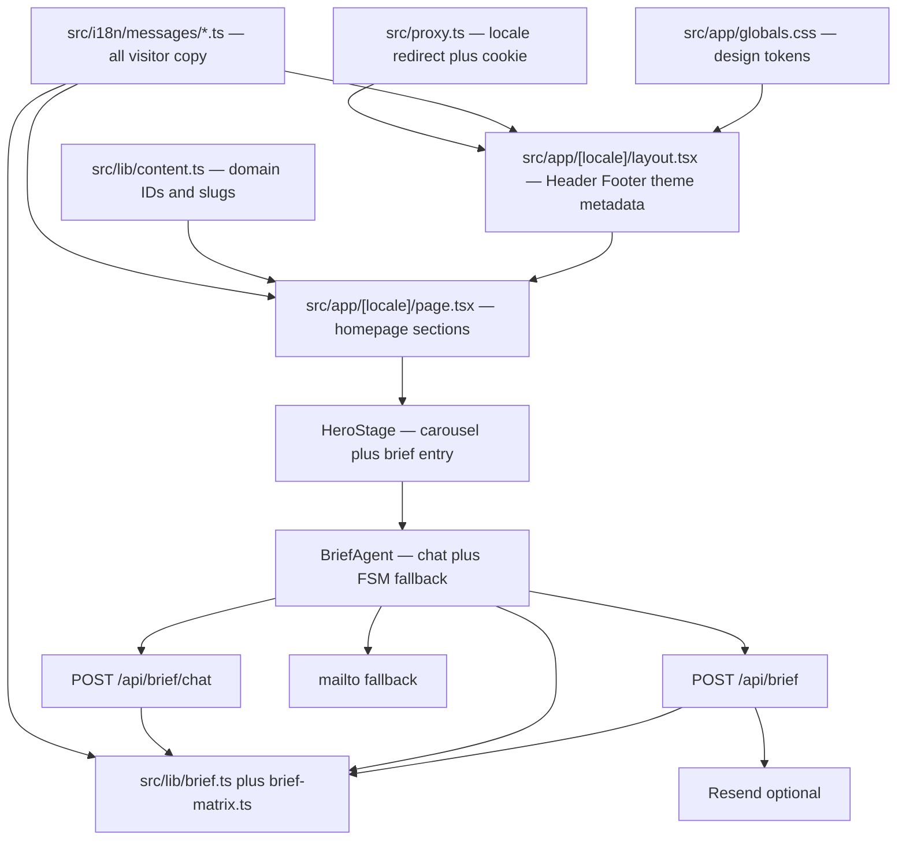

# Neora Labs

Marketing site for Neora Labs: technology advisory and custom software for startups and SMEs in Europe and the United States. Three locales (`es` default, `en`, `pl`). Homepage, a services hub with one page per service, contact, privacy, and an advisory brief. Human onboarding lives in `README.md`.

Stack: Next.js 16 App Router, React 19, TypeScript, Tailwind CSS v4, Manrope.

Do not add a CMS, a fourth locale, extra top-level routes, or a new product surface unless the user asks.

## Architecture

- `src/proxy.ts` redirects `/` to `/{locale}`, negotiating the `neora-locale` cookie then `Accept-Language`, defaulting to `es`.
- Shell (Header, Footer, theme boot script, metadata) lives in `src/app/[locale]/layout.tsx`. Every route is statically generated per locale (`generateStaticParams` plus `dynamicParams = false`).
- Homepage composition in `src/app/[locale]/page.tsx`: Hero → Positioning → Services → Process → Values. `ClosingCta` now lives on `/[locale]/contacto`.
- Visitor copy and site metadata live in `src/i18n/messages/{es,en,pl}.ts`, with per-service pages in `service-pages-*.ts`. `es` defines the `Messages` type; `en` and `pl` are checked against it with `satisfies`, so a key added to one must be added to all three. `src/lib/content.ts` holds only domain IDs, slugs, and asset paths — no prose.
- Design tokens live in `src/app/globals.css` (`:root`, `html.dark`, `@theme inline`). Components use semantic Tailwind classes, not hex.
- Capture flow: `HeroStage` opens `BriefMorphShell` → `BriefAgent`. Free-text turns go to `POST /api/brief/chat` (OpenAI classifies slots). The FSM in `getNextAgentTurn` is the fallback if the key is missing or the model fails. The report builder lives in `src/lib/brief.ts`. Cost and weeks are derived in `src/lib/brief-matrix.ts` (effort × weekly rate × need margin × stage uncertainty). Submit goes to `POST /api/brief`.

## Directory map

| Path | Role |
| --- | --- |
| `src/app/` | App Router: `[locale]` layout/page, `servicios`, `servicios/[slug]`, `contacto`, `privacidad`, `globals.css`, `api/brief`, `api/brief/chat`, `api/contact` |
| `src/proxy.ts` | Locale redirect and cookie (Next 16 replacement for `middleware.ts`) |
| `src/i18n/` | Locale config, negotiation, `interpolate`, and the `messages/` catalogs |
| `src/lib/content.ts` | Domain IDs (services, team), service slugs, asset paths |
| `src/lib/service-jsonld.ts` | Service and FAQ structured data |
| `src/lib/email-signature.ts` | Transactional email HTML wrapper |
| `src/lib/brief.ts` | Brief steps, validation, report, mailto |
| `src/lib/brief-agent.ts` | Chat turn schema, slot merge, OpenAI prompt |
| `src/lib/contact.ts` | Contact form parse, body, mailto |
| `src/lib/resend.ts` | Shared Resend send helper |
| `src/lib/cal.ts` | Cal.com embed URL guard |
| `src/lib/brief-matrix.ts` | Effort weeks, rates, margins → € + plazo |
| `src/lib/theme.ts` | Light/dark persistence and boot script |
| `src/lib/cn.ts` | Class-name helper |
| `src/components/sections/` | Homepage sections |
| `src/components/hero/` | Carousel and stage that opens the brief |
| `src/components/brief/` | Brief overlay and questionnaire UI |
| `src/components/international/` | Map and team roster (used by Values) |
| `src/components/layout/` | Header, Footer, ThemeToggle |
| `src/components/i18n/` | `MessagesProvider` (`useMessages`, `useLocale`) and `LocaleSwitcher` |
| `src/components/agenda/` | Cal.com overlay provider and trigger (`#agenda` hash) |
| `src/components/brand/` | Logo |
| `src/components/ui/` | Badge, Button, Card, Reveal |
| `src/components/services/` | Service hub, service page, card visuals |
| `tests/` | Vitest suites (node environment) |
| `public/` | Brand, service, and team assets |

Keep new files in the matching folder. Do not introduce `src/pages/` or a second router.

## Commands

| Command | When |
| --- | --- |
| `pnpm dev` | Iterate. Use this in agent sessions. |
| `pnpm lint` | Check before finishing. |
| `pnpm test` | Vitest. Check before finishing — it covers the brief matrix, routing of recommendations, and locale copy. |
| `pnpm exec tsc --noEmit` | Typecheck without touching `.next`. Safe in an agent session, unlike `build`. |
| `pnpm build` | Production only. **Do not run in an agent session** — it switches `.next` to production assets and breaks HMR. |

Restart `pnpm dev` after adding or updating dependencies so Next.js picks up the lockfile.

## Conventions

**Copy.** All visitor-facing strings — marketing, brief prompts, choice labels, validation messages, email subjects — live in `src/i18n/messages/{es,en,pl}.ts`. Change a string in all three locales, never in a component and never in `src/lib/`. Spanish is peninsular (`tú`, not `vos`); keep one register across the whole catalog.

**Tokens.** Use semantic classes from `@theme inline` in `src/app/globals.css`: `bg-bg-default`, `bg-bg-subtle`, `bg-bg-brand-soft`, `text-text-primary`, `text-text-secondary`, `text-text-brand`, `bg-action`, `text-action-fg`, `hover:bg-action-hover`, `bg-surface`, `bg-surface-raised`, `border-border-default`, `border-border-strong`, `text-accent`. Do not scatter hex. `#nosotros` is intentionally forced to the light palette even when the document is dark.

**RSC.** Server Components by default. Add `"use client"` only for interactivity (header, theme, hero/brief, carousels, reveal, map/team).

**TypeScript.** Strict. On `switch` over unions or enums, handle every variant and use a `never` check in `default` so new variants fail at compile time.

**Imports.** Keep imports at the top of the module. No inline imports unless a circular dependency is documented.

**UI primitives.** Reuse `Button`, `Badge`, `Card`, and `Reveal`. Do not add a component library.

**Next.js 16.** Do not add `middleware.ts`. If request interception is needed later, use `src/proxy.ts`. Read bundled docs under `node_modules/next/dist/docs/` before using APIs.

**Package manager.** pnpm only, pinned by `packageManager` in `package.json`. Add dependencies with `pnpm add`; never run `npm install` or `yarn` — they would regenerate a competing lockfile. `pnpm-lock.yaml` is the only lockfile and is committed. Direct dependencies are pinned to exact versions, and `saveExact: true` in `pnpm-workspace.yaml` keeps new ones exact (pnpm 10 ignores non-auth settings in `.npmrc`). Upgrade deliberately with `pnpm add <pkg>@<version>`, then run `pnpm audit`, `pnpm exec tsc --noEmit`, `pnpm lint` and `pnpm test`.

**Git.** Do not commit unless asked. Do not commit `.env*`.

## Brief and API

Seven advisory fields, in this order: `problem`, `currentProcess`, `businessImpact`, `scale`, `currentTools`, `desiredOutcome`, `urgency`. Email is **not** one of them — it is asked after the recommendation, and the report is never gated on it. In chat mode the order is not fixed; the model asks for what is missing, and `getNextAgentTurn` uses the sequence above as fallback.

The model picks one `recommendedRoute` of `keep_current | adopt_tool | integrate | automate | custom_build | advisory_sprint`; below `CONFIDENCE_FLOOR` (0.7) it is forced to `advisory_sprint`. Price and weeks never come from the model. `adaptBusinessAnswersToMatrix` translates the advisory answers into the commercial IDs, and `lookupInvestmentBand` derives the numbers. That adapter currently pins `stage` to `"operating"`, so the `idea` and `product` uncertainty multipliers in `brief-matrix.ts` never apply — deliberate until someone decides otherwise; changing it moves quoted prices.

- Client: `src/components/brief/BriefAgent.tsx` talks to `POST /api/brief/chat`, then POSTs completed answers to `/api/brief`.
- Chat server: `src/app/api/brief/chat/route.ts` classifies slots with OpenAI, re-validates IDs, and only then builds the report from the matrix.
- Submit server: `src/app/api/brief/route.ts` parses with `parseBriefAnswers`, builds the report, emails Neora, and if that succeeds sends a copy to the visitor.
- If `RESEND_API_KEY` is set and Resend succeeds, the API returns `{ emailed: true }` and the UI shows sent.
- Otherwise the API returns `{ emailed: false }` (or the fetch fails) and the client falls back to `mailto:` via `buildMailtoHref`.
- After the report, “Hablemos” opens the Cal.com overlay (`useAgenda`).

Optional env:

- `OPENAI_API_KEY` — brief chat agent (server only). Without it, the UI falls back to chips.
- `OPENAI_MODEL` — optional, defaults to `gpt-4o-mini`
- `RESEND_API_KEY` — send the brief and contact form to `site.email`
- `BRIEF_FROM_EMAIL` — Resend `from` (defaults to `Neora Labs <info@neora-labs.com>`)
- `NEXT_PUBLIC_CAL_URL` — public Cal.com booking URL (e.g. `https://cal.com/neoralabs/intro`)

## Contact and calendar

- Client: `ContactForm` POSTs to `/api/contact`. Server parses with `parseContactPayload` then Resend.
- If Resend is missing or fails, `{ emailed: false }` and the client falls back to `mailto:`.
- Header CTA and `#agenda` embed Cal.com when `NEXT_PUBLIC_CAL_URL` is a `https://cal.com/...` URL. Connect Google Calendar in Cal.com, not in Next.js.
- Privacy copy lives at `/[locale]/privacidad`.

Do not put secrets in client code. Do not retune bands in `src/lib/brief-matrix.ts` without being asked — they are commercial data.

## Security

- `.env*` is gitignored. Never commit API keys or credentials.
- Validate brief payloads on the server (`parseBriefAnswers`) and contact payloads (`parseContactPayload`). Do not trust the client body.
- `RESEND_API_KEY` and `OPENAI_API_KEY` stay in Route Handlers. They must not appear in client bundles or `NEXT_PUBLIC_*`.

## UI verification

When a change affects layout, styling, routing, client state, or rendered data, verify in the browser (or the closest substitute if browser tools are unavailable). Confirm behavior, not only a screenshot.

- Exercise the changed flow end to end (including opening the brief from the hero and completing or closing it).
- Check light and dark. Remember `#nosotros` stays light.
- Hunt for regressions in Header, Footer, and other sections that share the copy or components you touched.

<!-- BEGIN:nextjs-agent-rules -->

# This is NOT the Next.js you know

This version has breaking changes — APIs, conventions, and file structure may all differ from your training data. Read the relevant guide in `node_modules/next/dist/docs/` (resolved from this file's directory; in monorepos the `next` package may not be visible from the repo root) before writing any code. Heed deprecation notices.

This block is written and re-added by `next dev` — verify at `node_modules/next/dist/server/lib/generate-agent-files.js`. Removing it from a diff only re-creates the uncommitted change; committing it with your work keeps the tree clean.

<!-- END:nextjs-agent-rules -->
